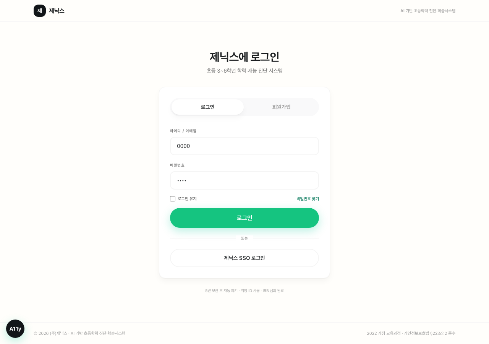
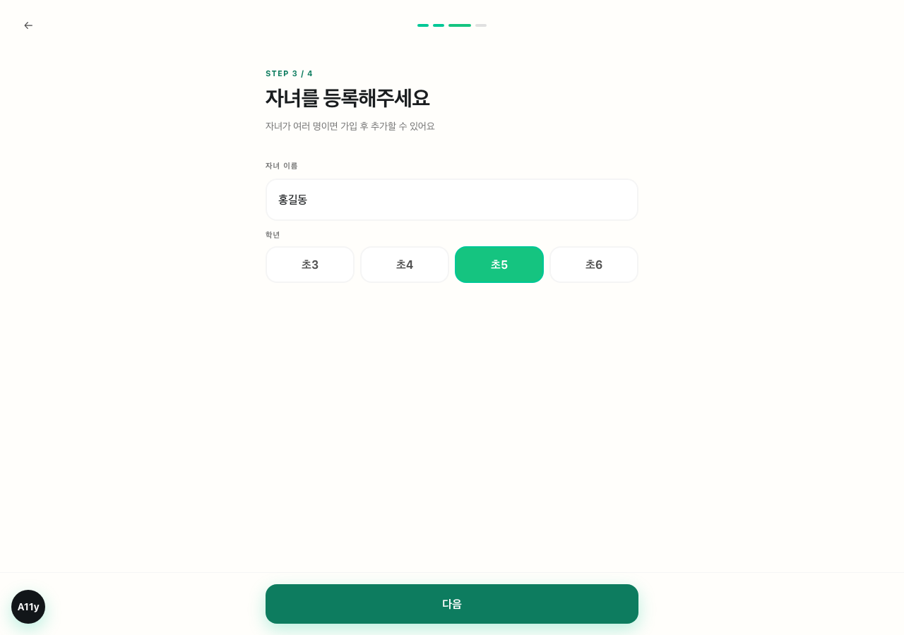
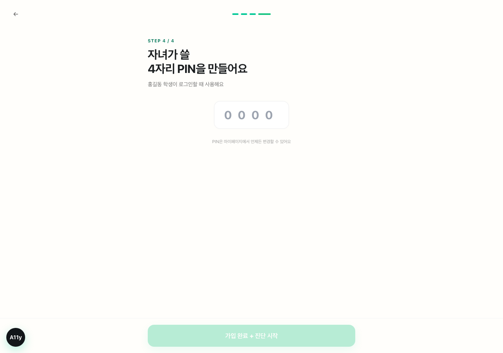
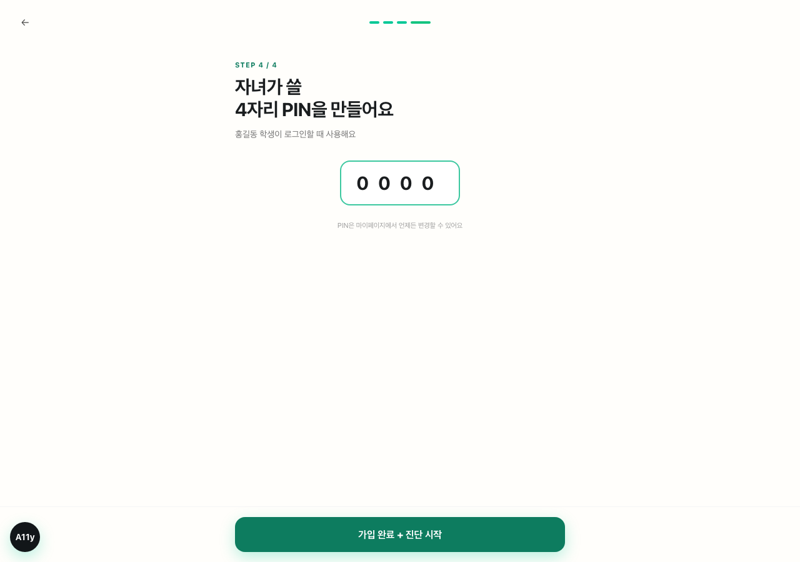
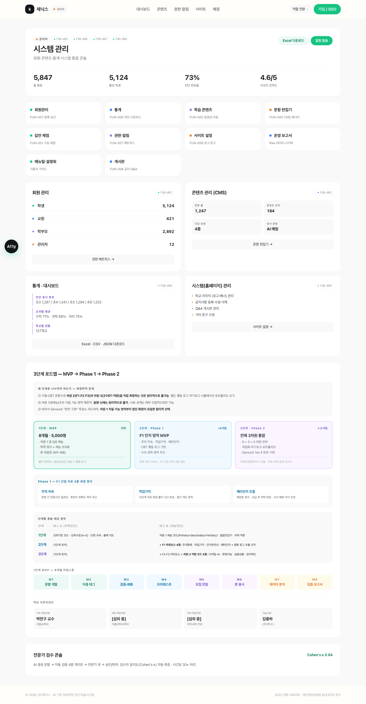
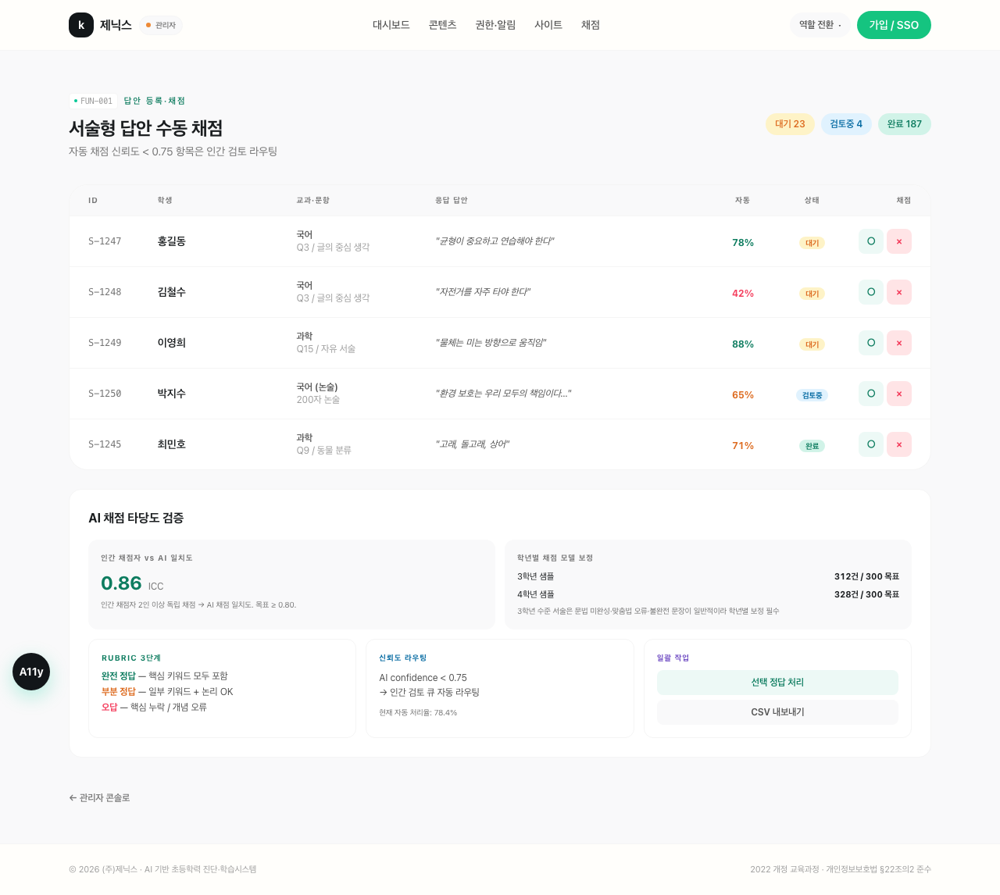
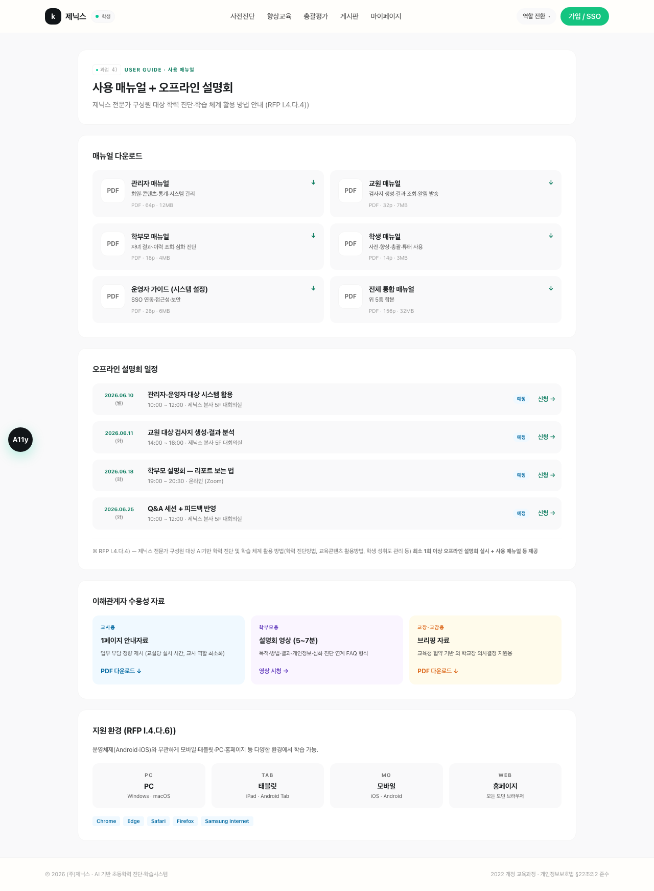
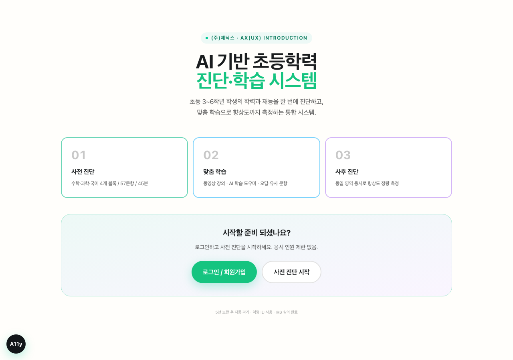
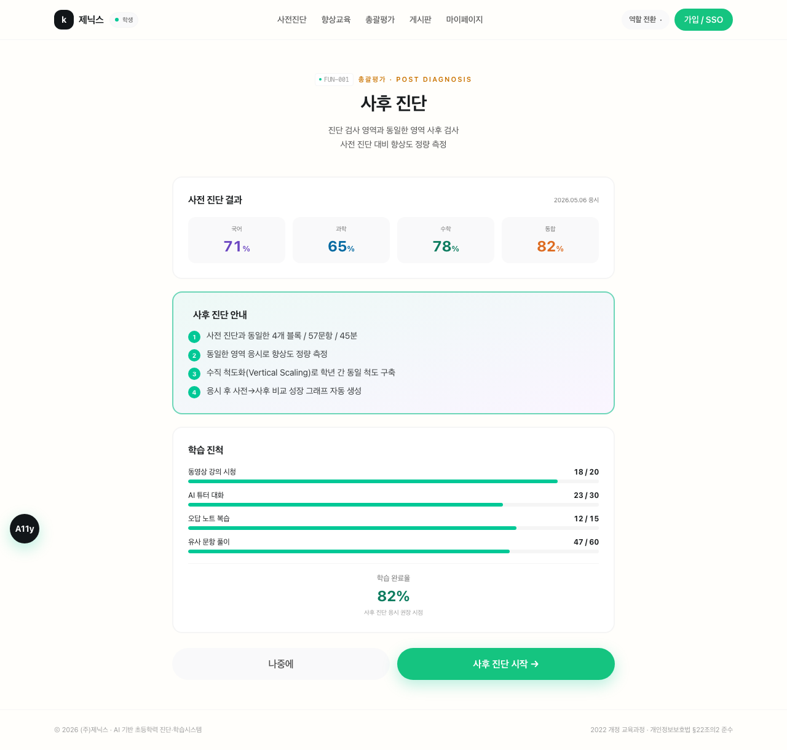

# 제닉스 AI 기반 초등학력 진단·학습시스템 — 프로토타입 화면 캡처 매트릭스

> **과업지시서 V2 + GeniusX 파일럿 설계 확정안 기반 프론트엔드 프로토타입**
>
> **라이브 사이트**: https://inno-hi-inc.github.io/kidsdiag-app/
> **저장소**: https://github.com/INNO-HI-Inc/kidsdiag-app
> **캡처 일자**: 2026-05-07 / **총 캡처**: 41장 (1280 × 900 풀페이지)

---

## 📑 목차

- [개요](#개요)
- [홈 / 로그인 진입](#홈--로그인-진입)
- [회원가입 — 4단계 위저드](#회원가입--4단계-위저드)
- [FUN-001 — 진단 시작 + 진단 응시](#fun-001--3개-영역-기초학습-진단총괄-검사)
- [FUN-002 — 진단 결과 + 학부모 리포트](#fun-002--진단총괄-검사-결과-및-종합-결과)
- [FUN-003 — 향상교육 + 학생 풀이 + AI 튜터](#fun-003--학력-학습-학습-기능)
- [FUN-004 — 학생 마이페이지](#fun-004--학습이력-관리)
- [FUN-005 — 콘텐츠 관리 (CMS·학습 콘텐츠)](#fun-005--콘텐츠-관리-시스템)
- [FUN-006 — 통계 + 운영 보고서](#fun-006--통계-기능)
- [FUN-007 — 권한 매트릭스 + 회원관리 + 교원](#fun-007--권한-관리-기능)
- [FUN-008 — 게시판 + 시스템 관리](#fun-008--시스템홈페이지-관리-기능)
- [추가 페이지](#추가-페이지)
- [충족 매트릭스](#충족-매트릭스)

---

## 개요

본 프로토타입은 (주)제닉스의 「AI 기반 초등학력 진단 및 학습시스템」 과업지시서 V2와 GeniusX 파일럿 설계 확정안 27p의 모든 요구사항을 화면 단위로 시각화한 **프론트엔드 데모**입니다.

### 핵심 사양

| 항목 | 값 |
|---|---|
| **대상** | 초등 3~6학년 약 6,000명 |
| **교과** | 수학 / 과학 / 국어(논술) — 3교과 + 통합사고력 |
| **분량** | 57문항 / 45분 (4블록 자동 진행) |
| **사용자 역할** | 학생 / 교원 / 학부모 / 관리자 (4종 RBAC) |
| **재능 매핑** | 8개 재능 중 5개 측정 + 3개 미발현 (GeniusX) |
| **검증 체계** | Cohen's κ ≥ 0.7 / Cronbach α ≥ 0.80 / IRT 2PL/3PL / CFA CFI ≥ 0.90 / 직교성 r ∈ [0.3, 0.6] |

### 기술 스택
- **프레임워크**: Next.js 14 + TypeScript + Tailwind CSS
- **배포**: GitHub Pages (정적 export)
- **인증**: 데모 모드 (이메일/비밀번호 0000)
- **반응형**: 모바일/태블릿/PC + 햄버거 메뉴
- **접근성**: WCAG 2.1 한국형 토글 (글자 크기·고대비·TTS — 좌하단 A11y 위젯)

---

## 홈 / 로그인 진입

| 캡처 | 화면 |
|---|---|
|  | **홈 — 로그인 / 회원가입 진입** [/](https://inno-hi-inc.github.io/kidsdiag-app/) |

**기능**:
- 컴팩트 헤더 (제닉스 로고 + 시스템명)
- 중앙 정렬 카드 (로그인 / 회원가입 탭)
- 이메일·비밀번호 input (기본 `0000` / `0000`)
- 로그인 유지 + 비밀번호 찾기
- 로그인 클릭 → `/select` 진입 (검증 없음)
- 제닉스 SSO 로그인 보조 버튼
- 푸터 (저작권 + 컴플라이언스)

---

## 회원가입 — 4단계 위저드

| 단계 | 캡처 | 설명 |
|---|---|---|
| **Step 1** |  | 학부모 정보 (성함·이메일·비밀번호) |
| **Step 2** |  | **동의 5종** — 법정대리인·학력·재능·**종단 추적**·마케팅 + 데이터 거버넌스 안내 (IRB·PIA·최소수집·재동의) |
| **Step 3** |  | 자녀 등록 (이름·학년 4선택) |
| **Step 4** |  | 4자리 PIN 생성 (자녀 로그인용) |
| **Step 4 입력** |  | PIN 0000 입력 시 활성화 |

**URL**: [/signup](https://inno-hi-inc.github.io/kidsdiag-app/signup/)

**핵심**: GeniusX 데이터 거버넌스(만 14세 미만 법정대리인 동의·5년 보관·익명 ID·**서울교대 IRB 박민구 교수 책임 체제**) 모두 명시

---

## FUN-001 — 3개 영역 기초학습 진단·총괄 검사

### 🎯 RFP 정의
> 3개 영역 진단·총괄 검사 + 답안 입력 / 응시 결과 / 멀티미디어 재생 / 정답채점기준 / 정·오답 선택 / 검사지 생성 / 답안 등록 채점

### A. 진단 시작 위저드 (Toss 스타일 6단계)

| 단계 | 캡처 | 설명 |
|---|---|---|
| **Step 1** |  | 진단 유형 — 사전 / 사후 |
| **Step 2** |  | 학년 선택 (초3·4·5·6 큰 카드) |
| **Step 3** |  | **학과별 맞춤** 소속 학교·반 |
| **Step 4** |  | 자신 있는 과목 다중 선택 (RFP 기획요구 1) |
| **Step 5** |  | 도움이 필요한 교과 (다중 선택) |
| **Step 6** |  | 데이터 수집 동의 + 진단 안내 요약 |

**URL**: [/select](https://inno-hi-inc.github.io/kidsdiag-app/select/)

### B. 진단 시작 전 안내 (Toss 스타일 5단계)

| 단계 | 캡처 | 설명 |
|---|---|---|
| **안내 1** |  | 총 45분 · 4블록 시각화 (국어 10 / 과학 20 / 수학 15 / 통합 12) |
| **안내 2** |  | 모르면 '잘 모르겠어요' (점수 차감 X) |
| **안내 3** |  | 한 번 답하면 못 돌아가요 (자동 저장) |
| **안내 4** |  | 잠깐 쉬어도 OK (일시정지) |
| **안내 5** |  | 응시 데이터 기록 (응답·풀이시간·답 변경·재검토) |

**URL**: [/diagnose/demo](https://inno-hi-inc.github.io/kidsdiag-app/diagnose/demo/)

### C. 진단 응시 화면 (실제 문제 풀이)

| 캡처 | 설명 |
|---|---|
|  | **진단 응시** — 4블록 진행도 도트 + 시간 카운터 + 일시정지 + 정답채점기준 보기 + 정·오답 자가 표시 + 4지선다 보기 + **하단 sticky** 잘 모르겠어요/제출 버튼 |
|  | **보기 선택 후** — 보기 색상 변경 + 제출 버튼 활성화 |

---

## FUN-002 — 진단·총괄 검사 결과 및 종합 결과

### 🎯 RFP 정의
> 영역별 결과 + 종합결과(랭킹·진도) 성적표 + 시각화 자료 + 별도 프로그램 설치 없이 서비스

| 캡처 | 화면 |
|---|---|
|  | **진단 결과 페이지** [/result/demo](https://inno-hi-inc.github.io/kidsdiag-app/result/demo/) |
|  | **학부모 리포트 PDF 3페이지** [/parent/report/child_demo](https://inno-hi-inc.github.io/kidsdiag-app/parent/report/child_demo/) |

**진단 결과 화면 구성**:
1. 응시자 카드 (홍 아바타 + 홍길동 · 초5 · 사전 진단 완료)
2. **HERO** — 종합 마스터리 큰 숫자 + 전국 상위 32% 뱃지 + 또래/반 평균
3. 4교과 결과 가로 막대 (국어 71 / 과학 65 / 수학 78 / 통합 82)
4. 랭킹·진도 2×2 (반 5위·학교 12위·진도 7급·전국 32%)
5. 재능 프로필 (8각 SVG 레이더 + 8재능 그리드 + 강점 2 해설)
6. **윤리 메시지 ①②③** (8중 5만 측정 명시)
7. 맞춤 학습 가이드 ①②③
8. GeniusX 심화 진단 CTA (검정 카드)
9. 빠른 액션 3버튼

**학부모 리포트 (PDF 3페이지)**:
- **P. 1 / 3** — 학력 결과 (성취수준·전국 분포 백분위·부진 영역 학습 가이드 3줄)
- **P. 2 / 3** — 재능 프로필 (8각 레이더 + 강점 2 해설 + **발달단계 민감기 시각화** 8재능)
- **P. 3 / 3** — GeniusX 심화 진단 안내 (발현 조건 3차원 + 21세기 역량 4차원 + 게임화·포트폴리오·평정·진로 보고서)

---

## FUN-003 — 학력 학습 학습 기능

### 🎯 RFP 정의
> 수학 외 타 영역의 온라인 학습 동영상 강의를 탑재하고 제공할 수 있어야 함

| 캡처 | 화면 |
|---|---|
|  | **향상교육** [/improvement](https://inno-hi-inc.github.io/kidsdiag-app/improvement/) — 동영상 8편 + 자료실 + AI도우미 + 추천/오답/유사 |
|  | **학생 직접 풀이** [/improvement/practice](https://inno-hi-inc.github.io/kidsdiag-app/improvement/practice/) — 객관식 풀이 + 해설 + 풀이 5단계 + 유사 문항 (중등 연계 표시) |
|  | **AI 학습 도우미** [/tutor](https://inno-hi-inc.github.io/kidsdiag-app/tutor/) — Socratic 5단계 힌트 + **안전 4뱃지** (정답직답금지·부적절차단·할루시검사·학부모모니터링) |

**향상교육 동영상 8편 (실제 YouTube 검색 연결)**:
- EBS Math: 분수의 덧셈·통분 / 비와 비율 / 도형의 둘레와 넓이
- EBS 초등: 물질의 상태와 변화 / 글의 중심 생각 / 어휘 확장 / 글의 구조
- EBS Kids: 동물의 분류
- Khan Academy 한국어: 비와 비율

---

## FUN-004 — 학습이력 관리

### 🎯 RFP 정의
> 진단/총괄 검사·향상학습 활동 이력관리 + 일자·학습 시간·학습 내용 + 종합 대시보드

| 캡처 | 화면 |
|---|---|
|  | **학생 마이페이지** [/mypage](https://inno-hi-inc.github.io/kidsdiag-app/mypage/) |

**구성**:
- 응시자 헤더 (홍길동 · 학번 2026-05-1247 · 5-3) + KPI 4개
- 영역별·종합결과 (사전 → 사후 비교 카드 4교과)
- **학습이력관리 타임라인** 5건 (사전 진단 / AI 튜터 / 향상 교육 / 유사 문항 / 오답 노트)
- 진단·총괄 현황 조회 표
- 빠른 액션 3개

---

## FUN-005 — 콘텐츠 관리 시스템

### 🎯 RFP 정의
> 문항·향상 학습 자료 입력·열람·수정·삭제 + 메타데이터·지문·보기·파일 등록 + 텍스트·이미지·수식·레이아웃·특수기호 편집 + 메타데이터 검색

| 캡처 | 화면 |
|---|---|
|  | **문항 편집기** [/admin/cms-editor](https://inno-hi-inc.github.io/kidsdiag-app/admin/cms-editor/) |
|  | **학습 콘텐츠 관리** [/admin/content](https://inno-hi-inc.github.io/kidsdiag-app/admin/content/) — 동영상 6편 CRUD + **국어 블록 내부 구성** + **이독성 -0.5 통제** + **4학년 슬럼프 (Chall 1983)** |

**문항 편집기 핵심**:
- 메타데이터 검색 + 편집 툴바 9개 + 보기 4지선다 + 정답 라디오
- **PDF 별첨1 9종 메타데이터 dropdown** (탐구요소 12·탐구과정 7·Bloom 6·재능영역 7·문항형태 21)
- **태그 A·B 확장** 7종 + IRT 모수 3종
- 이중 태그 3단 검증 (개발자 → 전문가+자문 → 실증)
- **4대 공통 구조 이슈** 점검 (메타누락·시간비정상·단원혼재·정답 정확성)
- 문항 검토 등급 4단계 (모범 / 수정 / 재작성 / 초과)
- 문항 보안 (앵커/공개 + 캡처방지·동적회전·OS테스트)
- 파일 업로드 (음성·동영상·이미지)

---

## FUN-006 — 통계 기능

### 🎯 RFP 정의
> 학생 분류(성별·학교·학년) 전체 현황 + 진단/총괄 영역별 이용·수준 현황 + 데이터 다운로드(엑셀)

| 캡처 | 화면 |
|---|---|
|  | **통계 대시보드** [/admin/stats](https://inno-hi-inc.github.io/kidsdiag-app/admin/stats/) |
|  | **운영 결과 보고서 + Raw 데이터** [/admin/report](https://inno-hi-inc.github.io/kidsdiag-app/admin/report/) |

**통계 대시보드 구성**:
- KPI 4개 + Excel·CSV·JSON 다운로드 버튼
- **응시자 대표성 8지표** (5:3:2 / 저소득 ≥15% / 공립 ≥80% / 특수 3~5% / 영재원 ≤30%)
- **3·4학년 프로파일 변별도 차이** (σ 12.4→15.1, +22%, Levene's p=0.03 — Ver.4 민감기 이론 실증)
- **4요인 교차 분석표** (학년×성별×지역×소득, cell당 ≥100~150명)
- 학년별 / 성별 분포 차트
- 교과별 도넛차트 4과목
- 진단 5단계 수준 분포
- 영역별 이용 현황 표
- 학교별 TOP 5

**운영 보고서 구성**:
- 시각화 자료 8종 + Raw 데이터 8종 (응답·행동·튜터·동영상·오답·매핑·재능·메타)
- **CBT 응답 데이터 L1·L2·L3 계층** (정답·시간·행동 신호)
- **검증 5지표** 표 (Cronbach α / IRT / Infit·Outfit / CFA / 직교성 r) + 합격 기준 + 현재값
- **B플랜 5종** (α<0.80 / r>0.8 / r<0.2 / CFA미달 / 4,000명 미달)
- **Phase 1·2 자산 이전** 6종 (IRT 초기값 / 재능 기저 / F1 학습 / 종단 추적 / 학술 논문 2편)
- **TF 최종 의사결정 5요청**
- 종합 보고서 PDF 5장 구조
- 일괄 다운로드 (ZIP·Excel·CSV·JSON)

---

## FUN-007 — 권한 관리 기능

### 🎯 RFP 정의
> 등록 계정별 권한 관리 + 학생 대상자별 검색 및 알림 발송 + 4역할 권한 매트릭스

| 캡처 | 화면 |
|---|---|
|  | **권한 매트릭스** [/admin/permissions](https://inno-hi-inc.github.io/kidsdiag-app/admin/permissions/) — 4역할 × 12기능 + 학생 검색 + 알림 발송 폼 |
|  | **회원관리** [/admin/members](https://inno-hi-inc.github.io/kidsdiag-app/admin/members/) — 학생/교원/학부모 테이블 + 등록 폼 + 승인/수정/삭제 |
|  | **교원 대시보드** [/teacher](https://inno-hi-inc.github.io/kidsdiag-app/teacher/) — 27명 학생 응시 결과 + 검사지 생성 + 알림 발송 폼 |

---

## FUN-008 — 시스템(홈페이지) 관리 기능

### 🎯 RFP 정의
> 학교 이미지(로고·배너) 및 기타 문구 수정 + 공지사항 관리 + Q&A 게시판 등록·수정·삭제

| 캡처 | 화면 |
|---|---|
|  | **게시판** [/board](https://inno-hi-inc.github.io/kidsdiag-app/board/) — 공지 5건 + Q&A 5건 + 문의 채널 |
|  | **시스템(홈페이지) 관리** [/admin/site](https://inno-hi-inc.github.io/kidsdiag-app/admin/site/) — 로고·배너·파비콘 변경 + 사이트 문구 6종 + 공지·Q&A 통계 |

---

## 추가 페이지

### 관리자 메인 (3단계 로드맵 + M1~M8 + 자문위원)

| 캡처 | 화면 |
|---|---|
|  | **관리자 대시보드** [/admin](https://inno-hi-inc.github.io/kidsdiag-app/admin/) |

**구성**:
- 헤더 (KPI 6개 + Excel 다운로드 + 알림 발송)
- **8개 sub-route 빠른 진입 카드** (회원관리·통계·콘텐츠·CMS·채점·권한·사이트·게시판·보고서·매뉴얼)
- 4 모듈 카드 (회원·CMS·통계·시스템)
- **3단계 로드맵** (MVP → Phase 1 → Phase 2)
- **측정학적 한계 3가지** (왜 단계 분리 필요한가)
- 1단계 MVP — M1~M8 마일스톤 8칸
- **Phase 1 F1 간접 지표 3종** (주의지속·작업기억·메타인지 측정 방식)
- **단계별 중층 태깅 표** (1단계 / 2단계 +F1 4종 / 3단계 +차원3 4종)
- **자문위원진 4명** (박만구 교수·과학·국어·김종하 PM)
- 검수 콘솔 (Cohen's κ 0.84)

### 답안 채점 (FUN-001 보강)

| 캡처 | 화면 |
|---|---|
|  | **답안 채점** [/admin/grading](https://inno-hi-inc.github.io/kidsdiag-app/admin/grading/) |

**구성**:
- 서술형 답안 5건 (홍길동·김철수·이영희·박지수·최민호 등)
- 정·오답 자동 채점 + ICC 0.86 + 학년별 보정 (3학년 312건 / 4학년 328건)
- RUBRIC 3단계 (완전·부분·오답)
- AI confidence < 0.75 → 인간 검토 자동 라우팅 (자동 처리율 78.4%)
- 일괄 작업 (선택 정답 처리 / CSV 내보내기)

### 사용 매뉴얼 + 설명회

| 캡처 | 화면 |
|---|---|
|  | **매뉴얼·설명회** [/manual](https://inno-hi-inc.github.io/kidsdiag-app/manual/) |

**구성**:
- 매뉴얼 5종 (관리자/교원/학부모/학생/운영자) PDF 다운로드
- **오프라인 설명회** 일정 4회 (관리자 6/10·교원 6/11·학부모 6/18·Q&A 6/25)
- **이해관계자 수용성 자료 3종** (교사 1페이지·학부모 영상 5~7분·교장 브리핑)
- 환경 호환 안내 (PC/태블릿/모바일/홈페이지 + Chrome·Edge·Safari·Firefox)

### AX(UX) 인트로

| 캡처 | 화면 |
|---|---|
|  | **AX(UX) 인트로** [/intro](https://inno-hi-inc.github.io/kidsdiag-app/intro/) (RFP 라.5)) |

**구성**:
- 시스템 소개 + 3 STEP 흐름 (사전→맞춤→사후)
- 로그인/진단 시작 CTA

### 총괄평가 안내

| 캡처 | 화면 |
|---|---|
|  | **총괄평가** [/summative](https://inno-hi-inc.github.io/kidsdiag-app/summative/) |

**구성**:
- 사전 진단 결과 요약
- 사후 진단 안내 4가지
- 학습 진척 4지표 (동영상 시청 18/20·AI튜터 23/30·오답 노트 12/15·유사 문항 47/60·완료율 82%)
- 사후 진단 시작 CTA

---

## 충족 매트릭스

### 제닉스 RFP V2 — FUN-001 ~ FUN-008

| FUN ID | 정의 | 캡처 | 상태 |
|---|---|---|---|
| **FUN-001** | 3영역 진단·총괄 | 위저드 6장 + 인트로 5장 + 응시 2장 | ✅ |
| **FUN-002** | 결과 + 종합 (랭킹·진도) | 결과 1장 + 학부모 리포트 1장 | ✅ |
| **FUN-003** | 학력 학습 (동영상) | 향상교육 + 학생풀이 + AI튜터 3장 | ✅ |
| **FUN-004** | 학습이력 관리 | 마이페이지 1장 | ✅ |
| **FUN-005** | 콘텐츠 관리 | CMS Editor + 학습 콘텐츠 2장 | ✅ |
| **FUN-006** | 통계 (Excel) | 통계 + 운영 보고서 2장 | ✅ |
| **FUN-007** | 권한 관리 (4역할) | 권한 + 회원관리 + 교원 3장 | ✅ |
| **FUN-008** | 시스템(홈페이지) 관리 | 게시판 + 시스템관리 2장 | ✅ |

### GeniusX 파일럿 설계 확정안 27p

| 영역 | 핵심 항목 | 위치 |
|---|---|---|
| 1장 | 4대 공통 구조 이슈 + 4단계 검토 등급 + 별첨1 메타데이터 옵션값 | /admin/cms-editor |
| 2장 | 3단계 로드맵 + 측정학적 한계 3가지 + 단계별 중층 태깅 + Ver.4 4원칙 | /admin · /parent/report |
| 3장 | 57문항 4블록 + 5,000명 균형 + L1·L2·L3 + 이중 태그 3단 검증 + 검증 5지표 + M1~M8 + 학부모 리포트 PDF 3페이지 | /admin · /admin/report · /parent/report |
| 4장 | 응시자 대표성 8지표 + AI 채점 ICC + 문항 보안 + 윤리 메시지 3종 + 이해관계자 자료 + 데이터 거버넌스 + B플랜 5종 + Phase 1·2 자산 이전 | /admin/stats · /admin/grading · /admin/cms-editor · /result · /manual · /signup · /admin/report |
| 5장 | 자문위원진 4명 (박만구·과학·국어·김종하 PM) | /admin |
| 별첨 1 | 메타데이터 9종 dropdown 옵션값 | /admin/cms-editor |
| 종합결론 | TF 최종 의사결정 5요청 | /admin/report |

---

## 📦 산출물

- **17개 라우트** 모두 정적 export · GitHub Actions 자동 배포
- **41장 풀페이지 PNG** 캡처 (1280×900)
- **데모 데이터** — 홍길동·홍선생님·홍부모·김철수/이영희/박지수/최민호/정수영
- **로그인 우회** — 어떤 값으로도 로그인 가능 (또는 빈 값)
- **YouTube 연결** — 동영상 강의 8편 클릭 시 EBS·Khan Academy 검색 결과
- **반응형** — 모바일/태블릿/PC + 햄버거 메뉴
- **접근성** — 좌하단 A11y 토글 (글자 크기·고대비·TTS)

---

**문의 / 시연 일정 협의**: (주)제닉스 김종하 PM (010-6523-5853)
