# 제닉스 AI 기반 초등학력 진단·학습시스템 — 화면 구현 매뉴얼

> **과업지시서 V2 + GeniusX 파일럿 설계 확정안 기반 프론트엔드 프로토타입**
>
> 라이브: https://inno-hi-inc.github.io/kidsdiag-app/ · 저장소: https://github.com/INNO-HI-Inc/kidsdiag-app
> 41+ 화면 캡처 (1280×900 풀페이지) · 캡처 일자: 2026-05-07

---

## 3.1 FUN-001 · 3개 영역 진단/총괄 검사

### 핵심 기능 요구사항

사용자 유형(학생·교원·학부모·관리자)에 따라 다른 메인화면과 메뉴를 제공해야 하며, 소속 정보(학교·학년)를 기반으로 진단 페이지를 자동 배정해야 한다. 수식과 멀티미디어를 포함한 문항 에디터를 지원하고, 자동 채점 및 해설 기능을 제공해야 한다. 또한 웹 접근성(KWCAG 2.1)을 준수하고 다양한 OS·브라우저 환경을 지원해야 한다.

### 구현방안

로그인 시 사용자 유형을 자동으로 파악하여 학생·교원·학부모·관리자 각각에게 맞는 화면을 즉시 보여준다. 로그인 정보에 포함된 학교·학년 데이터를 읽어 해당 학생에게 알맞은 진단 검사지를 자동으로 배정한다.

시험이 끝나면 곧바로 채점 결과와 해설을 화면에 표시하며, 수식이나 도형이 포함된 문항도 불편함 없이 출제하고 풀 수 있도록 편집 도구를 갖춘다. PC·태블릿·모바일 어디서든 동일하게 이용할 수 있으며, 장애인 접근성 기준도 충족한다.

### 화면 구현

#### A. 진단 시작 위저드 — 소속 정보 + 설문 (Toss 스타일 6단계)

| Step 1 — 진단 유형 | Step 2 — 학년 | Step 3 — 학교·반 (학과별 자동 매칭) |
|---|---|---|
| 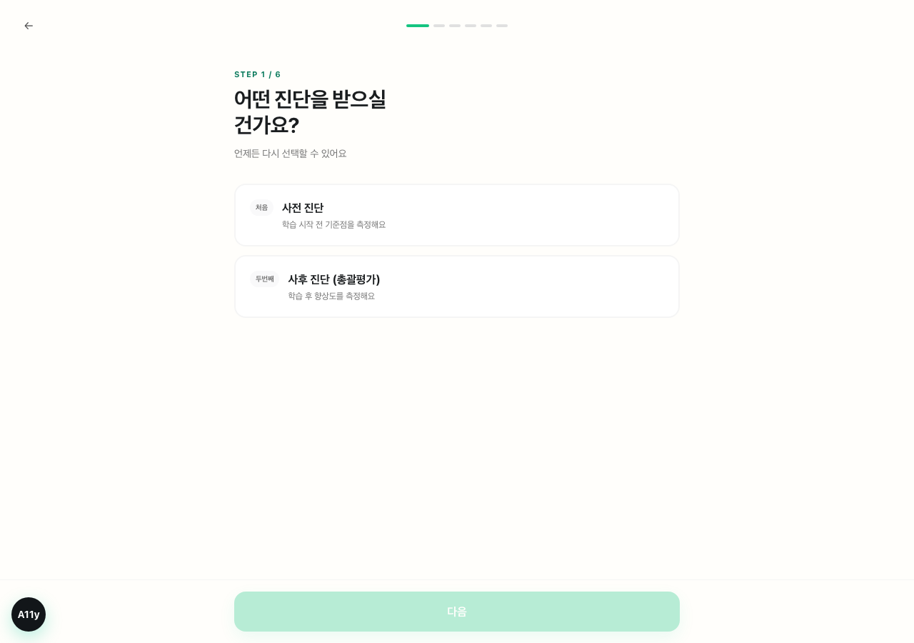 | 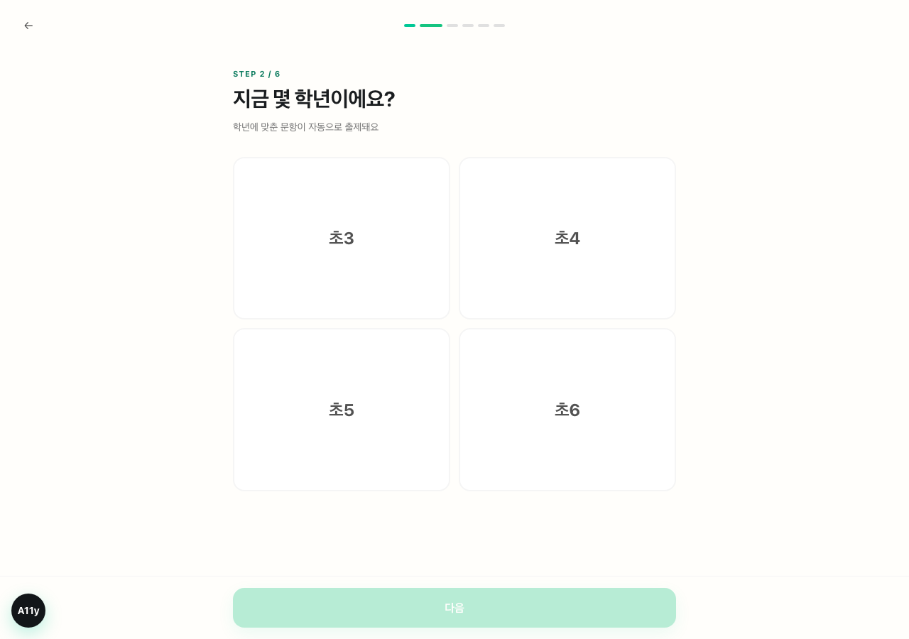 |  |

| Step 4 — 자신 있는 과목 | Step 5 — 부족 교과 | Step 6 — 데이터 동의 + 안내 |
|---|---|---|
| 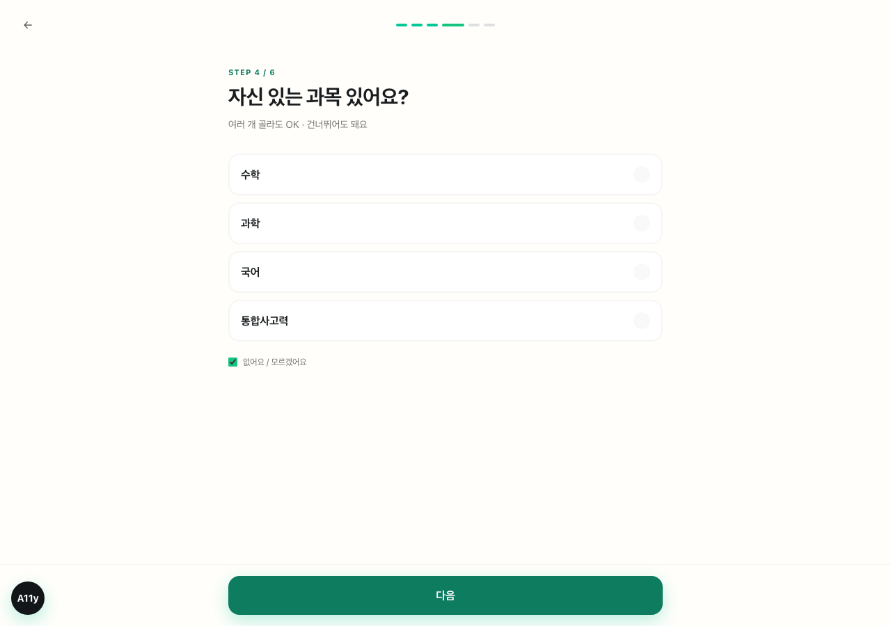 | 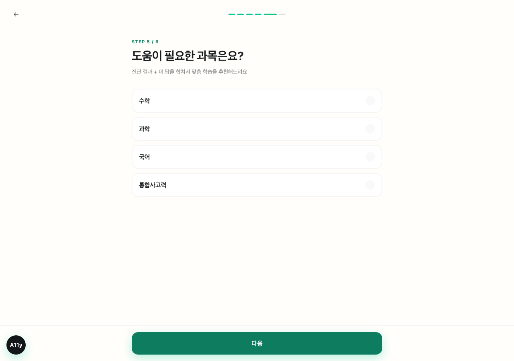 | 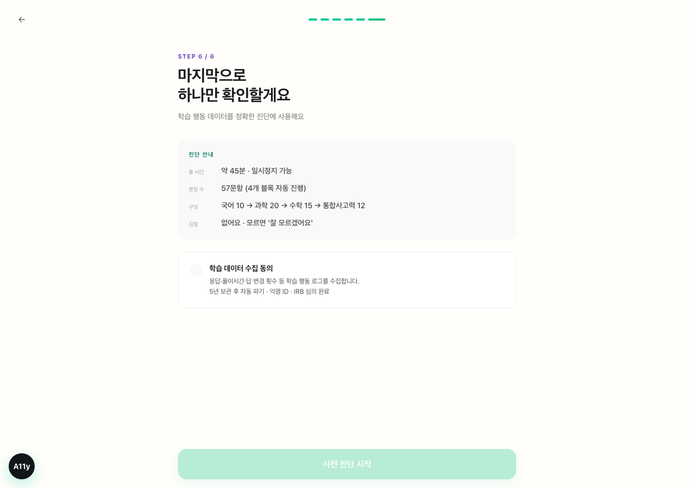 |

#### B. 진단 시작 전 안내 (5단계)

| 안내 1 — 45분 4블록 | 안내 2 — '잘 모르겠어요' | 안내 3 — 못 돌아가요 |
|---|---|---|
| 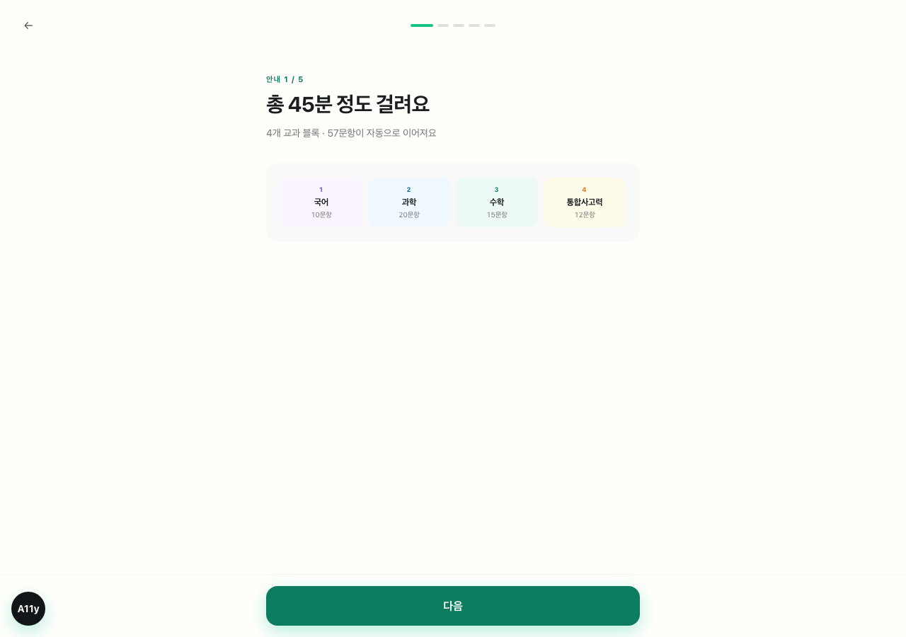 |  | 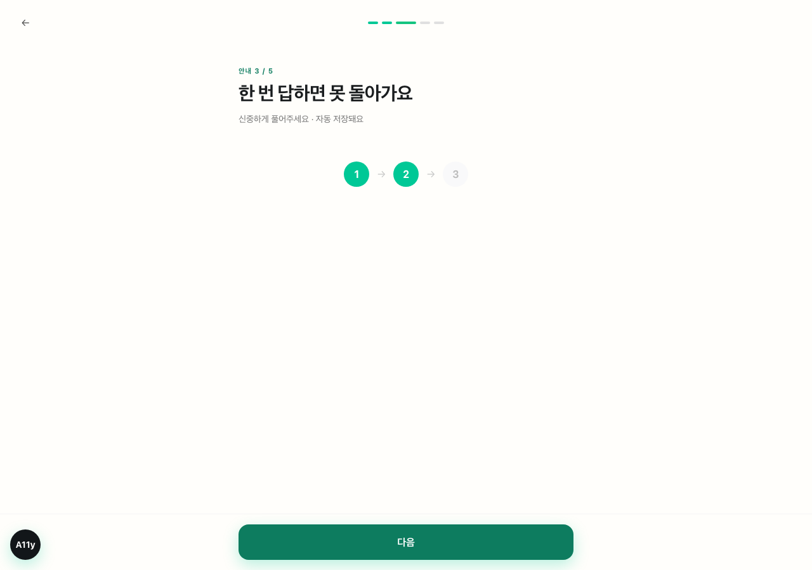 |

| 안내 4 — 일시정지 | 안내 5 — 데이터 기록 | |
|---|---|---|
|  | 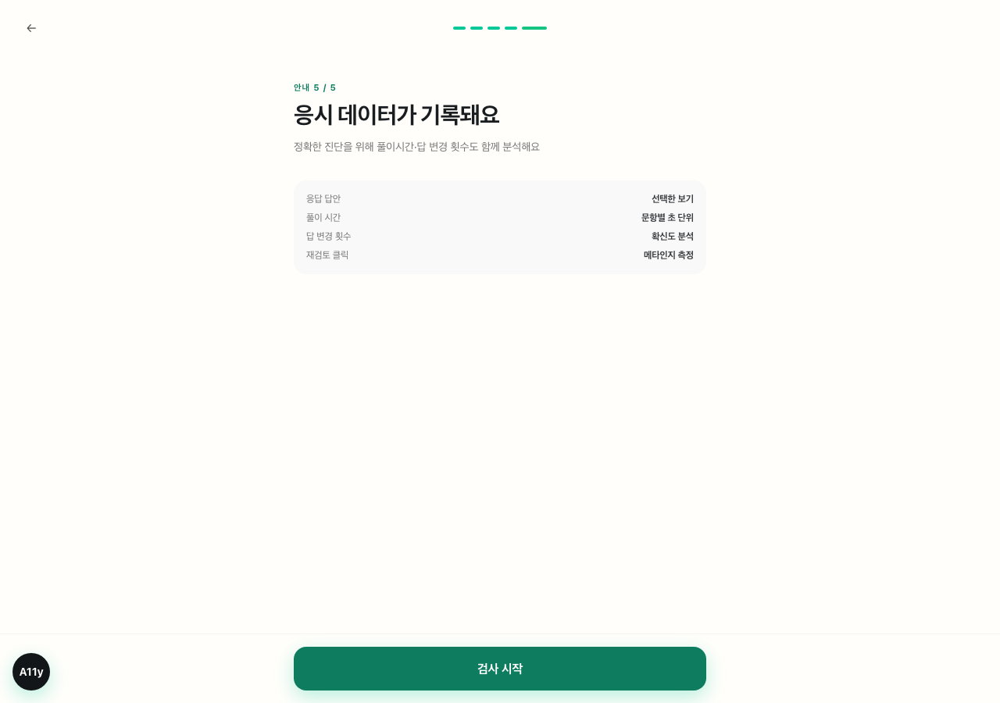 | |

#### C. 진단 응시 + 자동 채점·해설

| 진단 응시 화면 | 보기 선택 후 |
|---|---|
| 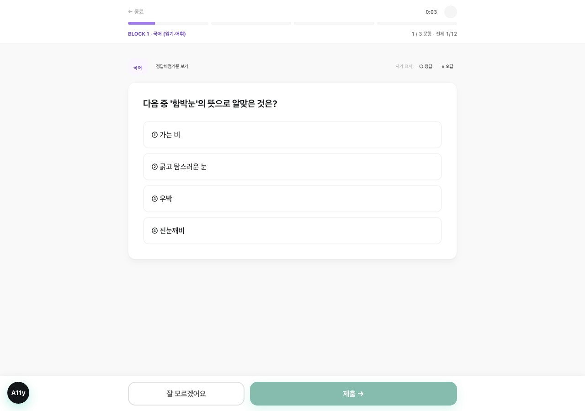 | 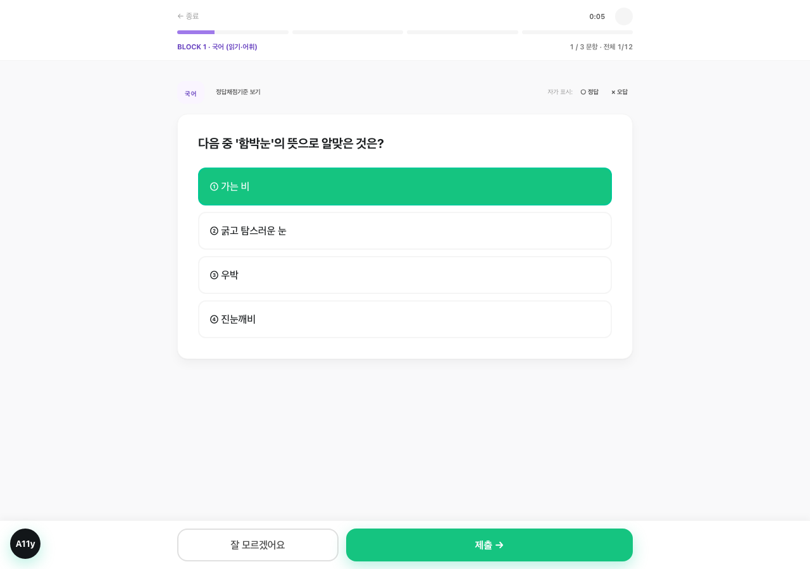 |

- 4블록 진행도 도트 + 시간 카운터 + 일시정지
- **정답채점기준 모달** + **정·오답 자가 표시 토글**
- 멀티미디어 재생 영역 (음성·동영상)
- **하단 sticky** 잘 모르겠어요 / 제출 버튼

#### D. 4역할 자동 화면·메뉴 분리 + 수식 문항 에디터

| 4역할 권한 매트릭스 | 수식·멀티미디어 문항 에디터 |
|---|---|
| 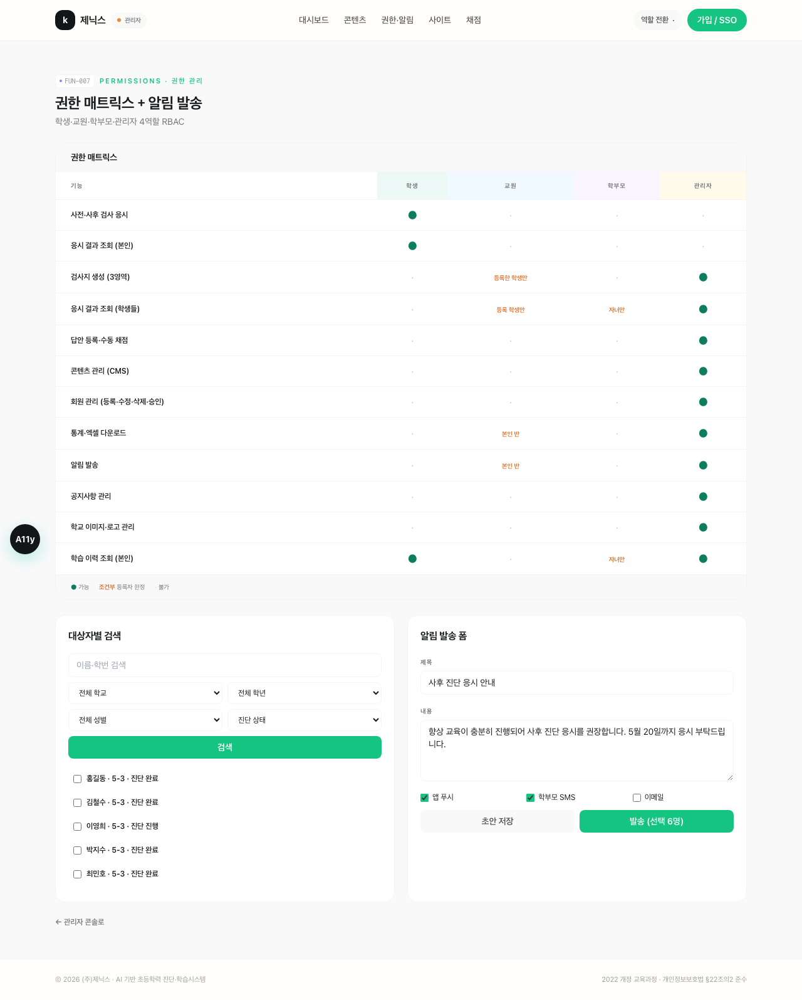 | 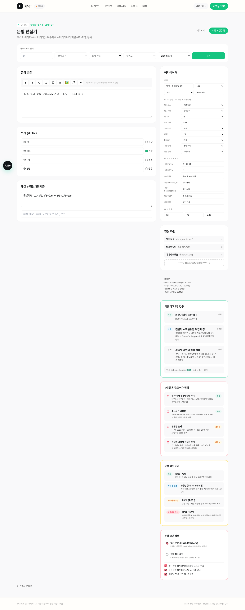 |

- 헤더에서 역할 자동 인식 → 메뉴 자동 전환 (학생 5 / 관리자 6 / 교원 4 / 학부모 3)
- 편집 툴바 9종 (B / I / U / **Σ 수식** / 특수기호 / 표 / 이미지 / 음성 / 동영상)
- 메타데이터 dropdown 9종 (탐구요소 / 탐구과정 / 난이도 / 소요시간 / 실시방법 / 배점 / Bloom / 재능영역 / 문항형태)
- LaTeX 수식 + Markdown + 음성 MP3 + 동영상 MP4 지원

#### E. 웹 접근성 (KWCAG 2.1) — 좌하단 A11y 위젯

전 페이지 좌하단 **A11y** 버튼 → **글자 크기 3단** / **고대비 모드** / **TTS 화면 읽기**

---

## 3.2 FUN-002 · 진단/총괄 검사 결과 및 종합결과

### 핵심 기능 요구사항

영역별(수학·과학·국어) 결과 화면을 제공하고, 랭킹·진도율이 포함된 성적표와 레이더·막대·라인 형태의 시각화 차트를 제공해야 한다. 별도 프로그램 설치 없이 웹에서 모든 기능이 동작해야 하며, 교원·관리자를 위한 학급·학교 단위 통계 화면도 필요하다.

### 구현방안

시험이 끝나는 즉시 수학·과학·국어 영역별 점수와 정답률이 화면에 자동으로 나타난다. 같은 학교·학년 학생들 사이에서의 순위와 학습 진도율도 함께 확인할 수 있으며, 레이더·막대·라인 등 다양한 형태의 차트로 결과를 한눈에 파악할 수 있다.

성적표 출력은 별도 프로그램 설치 없이 브라우저에서 바로 인쇄할 수 있으며, 교원·관리자는 학급 또는 학교 전체 통계를 별도 화면에서 확인할 수 있다.

### 화면 구현

#### A. 진단 결과 (학생용)

- HERO 종합 마스터리 큰 숫자 + **전국 상위 32%** 뱃지 + 또래·반 평균
- **영역별 가로 막대** (국어 71 · 과학 65 · 수학 78 · 통합 82)
- **랭킹·진도 2×2** (반 5위 · 학교 12위 · 학년 진도 7급 · 전국 32%)
- **재능 8각 SVG 레이더** + 강점 2 해설
- 윤리 메시지 ①②③ + 학습 가이드 ①②③ + 심화 진단 CTA

#### B. 학부모 리포트 (PDF 3페이지) — 별도 프로그램 설치 없이 웹 출력

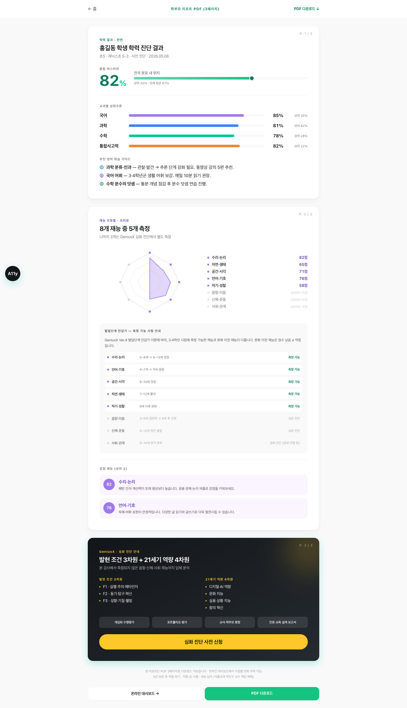

- **P. 1 / 3** — 학력 결과 (성취수준·전국 분포 백분위·학습 가이드)
- **P. 2 / 3** — 재능 프로필 + **발달단계 민감기 시각화 8재능**
- **P. 3 / 3** — GeniusX 심화 진단 안내
- 우상단 **PDF 다운로드** 버튼 (브라우저 인쇄)

#### C. 교원 학급 통계 + 관리자 학교/전체 통계

| 교원 — 학급 단위 | 관리자 — 학교/전국 |
|---|---|
|  |  |

- 교원: 27명 학생 사전·사후 비교 + 평균 마스터리 + 주의 학생 5명
- 관리자: 학년 막대 + 성별 도넛 + 교과별 라인 + A~E 5단계 분포
- 학교별 TOP 5 랭킹

#### D. 학생 마이페이지 — 사전·사후 라인 추이

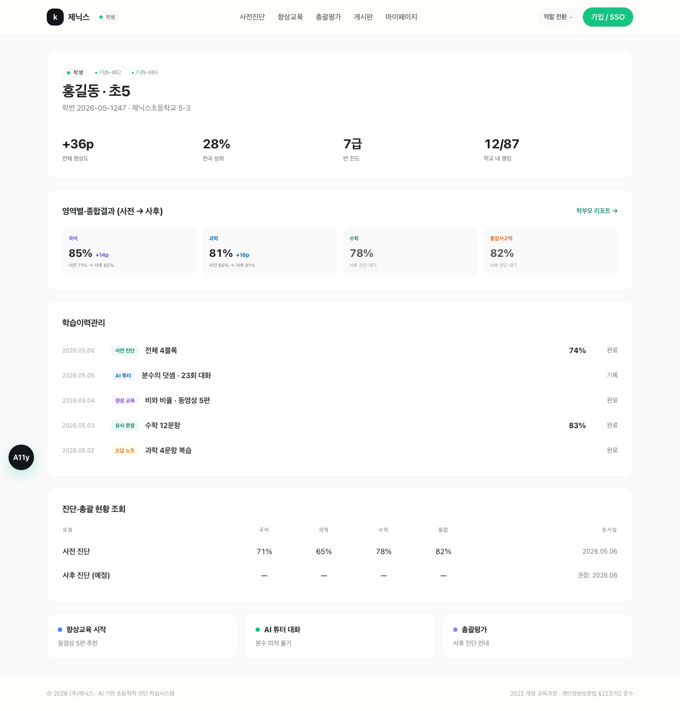

- 영역별·종합결과 카드 (사전 → 사후 비교 + 향상도 +Xp)
- 진단·총괄 현황 표 (사전·사후 일자별)

---

## 3.3 FUN-003 · 학력 향상교육 (학습 기능)

### 핵심 기능 요구사항

수학·과학·국어·논술 전 영역의 온라인 동영상 강의를 탑재하고 제공해야 한다. 동영상 플레이어(재생속도 조절·구간 반복·자막)를 지원하며, 강의별 첨부파일 다운로드, 풀이·해설 제공, 학습 완료 이력 자동 연동이 요구된다.

### 구현방안

수학·과학·국어·논술 전 영역의 강의 영상을 안정적으로 업로드하고 끊김 없이 재생할 수 있도록 한다. 학생은 재생 속도를 조절하거나 원하는 구간을 반복해서 볼 수 있으며, 자막도 함께 제공된다. 강의마다 관련 학습 자료를 첨부하여 다운로드할 수 있고, 영상 아래에는 해설과 수식 풀이를 함께 제공한다. 영상을 일정 비율 이상 시청하면 학습 완료로 자동 처리되어 이력 관리 시스템과 바로 연동된다.

### 화면 구현

#### A. 동영상 강의 라이브러리 + 플레이어 컨트롤

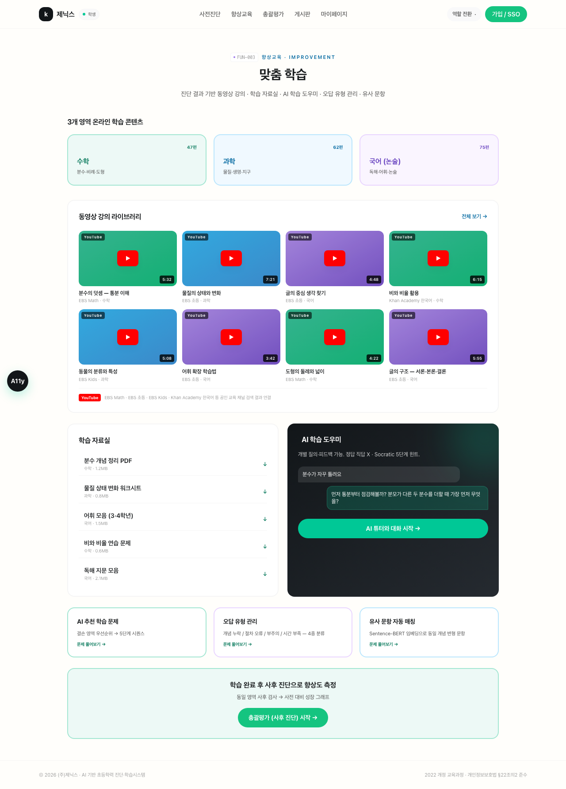

- 3개 영역 학습 콘텐츠 (수학 47편 / 과학 62편 / 국어 논술 75편)
- **YouTube 동영상 8편** 카드 (EBS Math · EBS 초등 · EBS Kids · Khan Academy 한국어)
- **동영상 플레이어 데모**
  - 재생/일시정지/이전/다음
  - **재생속도 5단** (0.75x · 1x · 1.25x · 1.5x · 2x)
  - **구간 반복** (시작·종료 시간 입력)
  - **자막 옵션 3종** (한국어 / 한국어+핵심단어 강조 / 끄기)
- **80% 시청 시 자동 학습완료 처리** + 이력 연동

#### B. 강의 첨부 자료 + 해설·풀이

- 강의 첨부 PDF 다운로드 (개념 정리 / 예제 풀이지 / 수업 자료 PPT)
- 영상 아래 풀이 5단계 (방향 → 개념 → 공식 → 과정 → 확인)
- 수식 풀이 LaTeX 렌더링

#### C. 학생 직접 풀이 + AI 학습 도우미

| 학생 풀이·해설 | AI 튜터 (Socratic 5단계) |
|---|---|
| 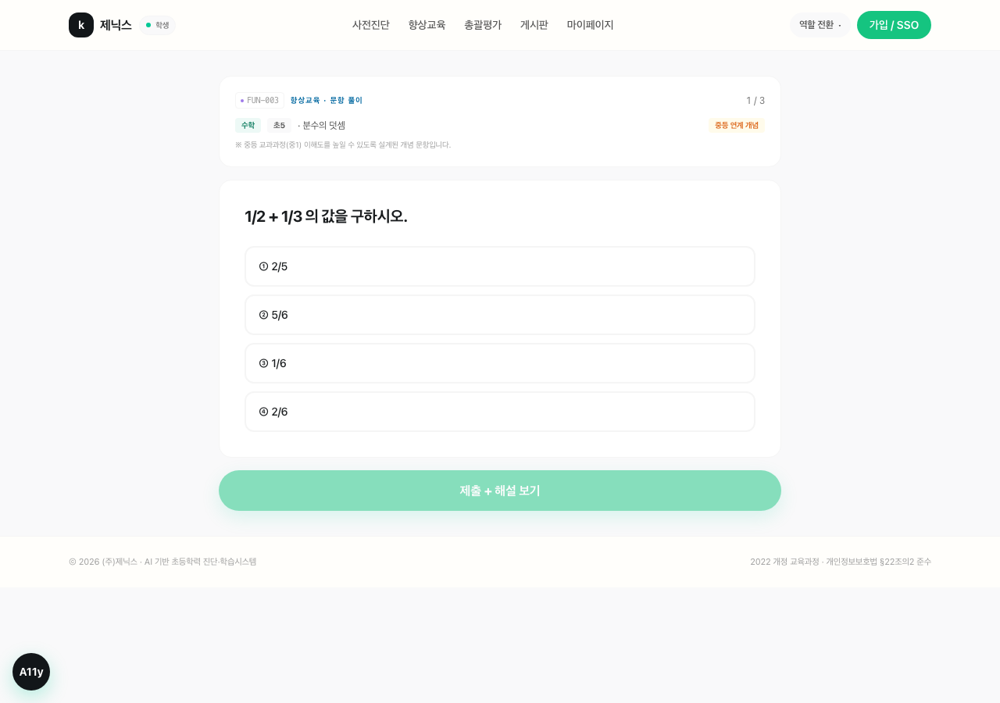 | 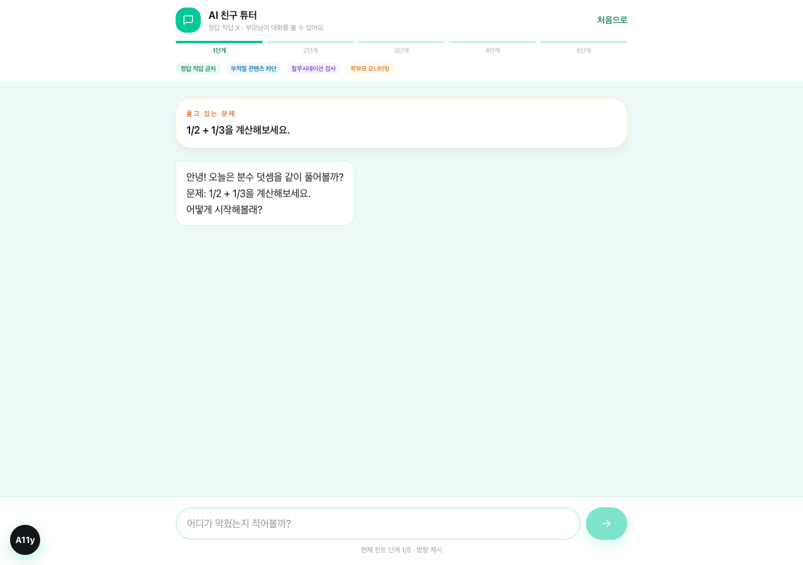 |

- 학생 풀이: 객관식 → 정·오답 표시 → 해설 → 풀이 5단계 → 유사 문항 (Sentence-BERT 매칭)
- AI 튜터: Socratic 5단계 힌트 + **안전 4뱃지** (정답직답 X · 부적절 차단 · 할루시 검사 · 학부모 모니터링)

---

## 3.4 FUN-004 · 학습 이력 관리

### 핵심 기능 요구사항

진단·총괄 검사 응시와 향상학습 활동의 이력(일자·시간·내용)을 수집하고, 대시보드 형태로 종합 정보를 제공해야 한다. 오답 분석 및 취약 단원 자동 태깅, 외부 문제은행 시스템과의 연동, 실시간 세션 상태 관리가 요구된다.

### 구현방안

학생이 시험을 보거나 강의를 시청하거나 오답을 풀 때마다 일자·시간·내용이 자동으로 기록된다. 누적된 이력은 대시보드에서 학습 시간 그래프, 점수 변화 추이, 자주 틀리는 단원 목록 등으로 한눈에 볼 수 있도록 정리된다.

반복해서 틀리는 문항은 자동으로 분석되어 취약 단원으로 표시되며, 집중 학습이 필요한 문항을 추천해준다. 외부 문제은행과도 연결되어 데이터를 주고받을 수 있으며, 현재 학습 진행 상황은 실시간으로 반영된다.

### 화면 구현

#### A. 학생 마이페이지 — 종합 대시보드

- 응시자 헤더 (학번 2026-05-1247 · 5-3) + KPI 4개 (향상도·전국 상위·반 진도·학교 랭킹)
- **영역별·종합결과** (사전 → 사후 4교과 카드)
- **학습이력관리 타임라인** 5건
  - 2026.05.06 사전 진단 · 전체 4블록 · 74% 완료
  - 2026.05.05 AI 튜터 · 분수의 덧셈 · 23회 대화 · 기록
  - 2026.05.04 향상 교육 · 비와 비율 · 동영상 5편 · 완료
  - 2026.05.03 유사 문항 · 수학 12문항 · 83% 완료
  - 2026.05.02 오답 노트 · 과학 4문항 복습 · 완료
- **진단·총괄 현황 조회 표** (사전/사후 × 4교과)
- **오답 자동 분석·취약 단원 태깅** (오답 노트 카드 + 자동 추천)

#### B. 외부 문제은행 연동 + 실시간 세션

- 학습 콘텐츠 CRUD + **외부 문제은행 ID 매핑** + 검토 상태 (공개/검토중/초안)
- **실시간 세션** — 진단 페이지 sticky 시간 카운터 / 일시정지·자동 저장

---

## 3.5 FUN-005 · 콘텐츠 관리 시스템 (CMS)

### 핵심 기능 요구사항

문항·향상학습 자료의 등록·열람·수정·삭제(CRUD)를 지원하고, 텍스트·수식·이미지·특수기호·멀티미디어 파일을 함께 편집·첨부할 수 있어야 한다. 메타데이터 기반 검색과 태그 A/B 이중 구조 관리, 파일 보안 및 최적화가 요구된다.

### 구현방안

관리자는 문항과 학습 자료를 손쉽게 등록·수정·삭제할 수 있으며, 일반 텍스트부터 수식·도형·이미지·음성·동영상까지 다양한 형태의 콘텐츠를 하나의 편집 화면에서 작성할 수 있다. 교과·학년·단원·난이도 등 세부 조건을 조합하여 원하는 문항을 빠르게 검색할 수 있으며, 자동완성 기능도 지원된다.

업로드된 파일은 악성 파일 여부를 자동으로 확인하고 용량 제한을 적용하여 안전하게 관리한다. 향후 재능진단 시스템 확장에 대비해 태그 구조도 미리 설계해둔다.

### 화면 구현

#### A. 문항 편집기 — 텍스트·수식·이미지·특수기호·멀티미디어

- 메타데이터 검색 (학년 / 교과 / 난이도 / Bloom dropdown)
- **편집 툴바 9종**: B · I · U · **Σ 수식** · 특수기호 · 표 · 이미지 · 음성 · 동영상
- 객관식 보기 4지선다 + 정답 라디오
- 해설 + 정답채점기준 키워드
- **메타데이터 23개 필드** (기본 4 / PDF 별첨1 9종 dropdown / 태그 A·B 확장 7 / IRT 모수 3)
  - 탐구요소 12 옵션 / 탐구과정 7 / Bloom 6 / 재능영역 7 / 문항형태 21
- **이중 태그 3단 검증** (개발자 → 전문가+자문 → 실증) — Cohen's κ ≥ 0.7
- **4대 공통 구조 이슈 점검** (메타·시간·단원·정답)
- 검토 등급 4단계 (모범 / 수정 후 수용 / 구조적 재작성 / 교육과정 초과)
- **문항 보안 정책** (앵커 vs 공개 / 캡처 방지 / 동적 회전 57→55 / OS별 테스트)

#### B. 학습 콘텐츠 관리 + 국어 내부 구성 + 이독성 통제

- 4개 탭 (동영상·자료실·유사 문항·오답 유형)
- 5개 검색 필터 (교과·학년·난이도·제목)
- 콘텐츠 테이블 — YouTube 뱃지 + 미리보기·수정·삭제
- **국어 블록 10문항 내부 구성** (어휘 3 / 문장 3 / 짧은 글 4)
- **이독성 -0.5 이하 통제** (4학년 슬럼프 — Chall 1983 학술 근거)

#### C. 파일 보안 및 최적화

- 지원 형식: Markdown · LaTeX · PNG·JPG·SVG (≤ 2MB) · MP3·WAV (≤ 5MB) · MP4 (≤ 30MB)
- 악성 파일 검사 + 용량 자동 제한
- **태그 A·B 이중 구조** (학력진단 / 재능진단 = GeniusX Phase 1·2 확장 대비)
- 1단계: 성취기준 + 차원1 재능 코드
- 2단계 확장: + F1 하위요소 4종 (주의통제·작업기억·인지유연성·메타인지)
- 3단계 확장: + 차원3 4종 (디지털AI·문화지능·실용상황·창의혁신)

---

## 3.6 FUN-006 · 통계 기능

### 핵심 기능 요구사항

학생 분류(성별·학교별·학년별) 통계, 진단·총괄 검사 영역별 이용 현황 및 수준 분포(A~E) 현황을 제공해야 한다. 엑셀 다운로드와 PDF 보고서 자동 출력이 가능해야 하며, 오답률 상위 문항 분석도 포함된다.

### 구현방안

관리자는 성별·학교·학년 등 원하는 기준으로 학생 통계를 조회할 수 있으며, 기간도 자유롭게 설정할 수 있다. 영역별 응시 현황과 수준 분포는 그래프로 시각화하여 쉽게 파악할 수 있다.

필요한 통계는 버튼 하나로 엑셀 파일 또는 PDF 보고서로 즉시 내려받을 수 있으며, 별도 프로그램 설치는 필요 없다. 학생들이 자주 틀리는 문항도 자동으로 분석되어 목록으로 제공된다.

### 화면 구현

#### A. 통계 대시보드 — 학생 분류·영역 현황·수준 A~E

- KPI 4개 + **다운로드 3버튼** (Excel · CSV · JSON)
- **응시자 대표성 8지표** (5:3:2 / 저소득 ≥15% / 공립 ≥80% / 특수 3~5% 등)
- **3·4학년 프로파일 변별도 차이** (σ 12.4→15.1, +22%, Levene's p=0.03)
- **4요인 교차 분석표** (학년×성별×지역×소득, cell당 ≥100~150명)
- **학년별 분포 막대** + **성별 분포 도넛**
- **교과별 평균 도넛 4개** (수학·과학·국어·통합)
- **성취수준 A~E 5단계 분포** (A 최우수 8% / B 우수 35% / C 보통 38% / D 미흡 14% / E 기초미달 5%)
- **오답률 상위 5문항 분석** (집중 학습 자동 추천 → 유사 문항 매칭)
- 영역별 이용 현황 표 (사전·향상·사후·평균 향상도·완료율)
- 학교별 TOP 5

#### B. 운영 결과 보고서 — PDF 자동 출력 + Raw 데이터

- **종합 보고서 PDF 5장 구조** (운영 개요 / 참여율 / 학력 결과 / 재능 분석 / 정책 제언)
- 시각화 자료 8종 + Raw 데이터 8종
- **CBT 응답 데이터 L1·L2·L3 계층** (정답·시간·행동 신호)
- **검증 5지표** (Cronbach α / IRT / Infit·Outfit / CFA·RMSEA / 직교성 r ∈ [0.3, 0.6])
- **B플랜 5종** (α<0.80 / r>0.8 / r<0.2 / CFA미달 / 4,000명 미달)
- **Phase 1·2 자산 이전** (IRT 초기값·재능 기저·F1 학습·종단 추적·학술 논문 2편)
- **TF 최종 의사결정 5요청**
- 일괄 다운로드 (ZIP·Excel·CSV·JSON)

---

## 3.7 FUN-007 · 권한 관리 기능

### 핵심 기능 요구사항

학생·교원·학부모·관리자 4종 계정 유형별 메뉴 접근 제어와 데이터 접근 범위 제한이 필요하다. 학생 대상 검색 및 알림 발송, 만 14세 미만 아동 개인정보 특별 보호가 요구된다.

### 구현방안

로그인한 계정 유형에 따라 볼 수 있는 메뉴와 접근 가능한 데이터 범위가 자동으로 제한된다. 학생은 자신의 데이터만, 교원은 담당 학급 데이터만, 학부모는 본인 자녀 데이터만 볼 수 있도록 철저히 구분된다.

관리자는 학생을 개별 또는 그룹으로 검색하여 시스템 알림을 한 번에 발송할 수 있다. 만 14세 미만 아동의 개인정보는 법적 보호 기준에 맞게 보호자 동의 절차를 거치고, 민감한 정보는 암호화하여 안전하게 보관한다.

### 화면 구현

#### A. 4역할 권한 매트릭스 + 학생 검색 + 알림 발송

- **4역할 × 12기능 매트릭스 표**
  - 학생: 본인 진단·이력만 / 교원: 담당 학급만 / 학부모: 본인 자녀만 / 관리자: 전체
  - **● 가능 / 조건부(등록자 한정) / · 불가** 3단계
- **학생 대상자별 검색** (이름·학번 + 학교·학년·성별·진단상태 dropdown)
- 다중 선택 체크박스 리스트
- **알림 발송 폼** (제목·본문·앱푸시·SMS·이메일)

#### B. 회원관리 — 등록·수정·삭제·승인

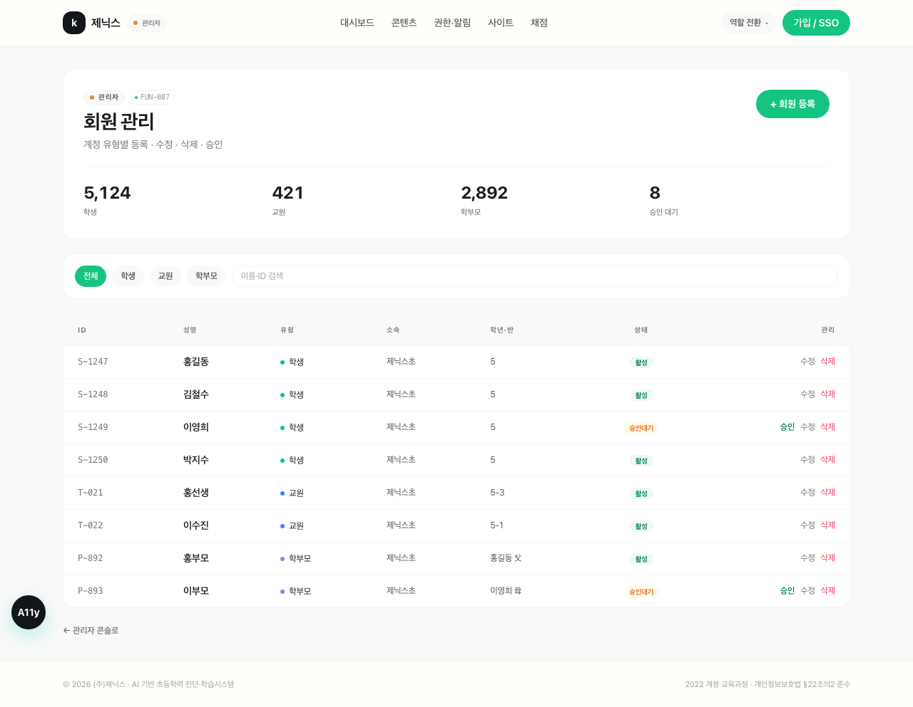

- 4역할 필터 + 검색
- 회원 테이블 (학생 4 / 교원 2 / 학부모 2 + 신규 등록 폼)
- **승인 대기** 상태 → 승인 / 수정 / 삭제 액션

#### C. 만 14세 미만 개인정보 보호 — 가입 단계 동의 5종

| 회원가입 정보 | 동의 5종 (법정대리인 + 4종) |
|---|---|
| 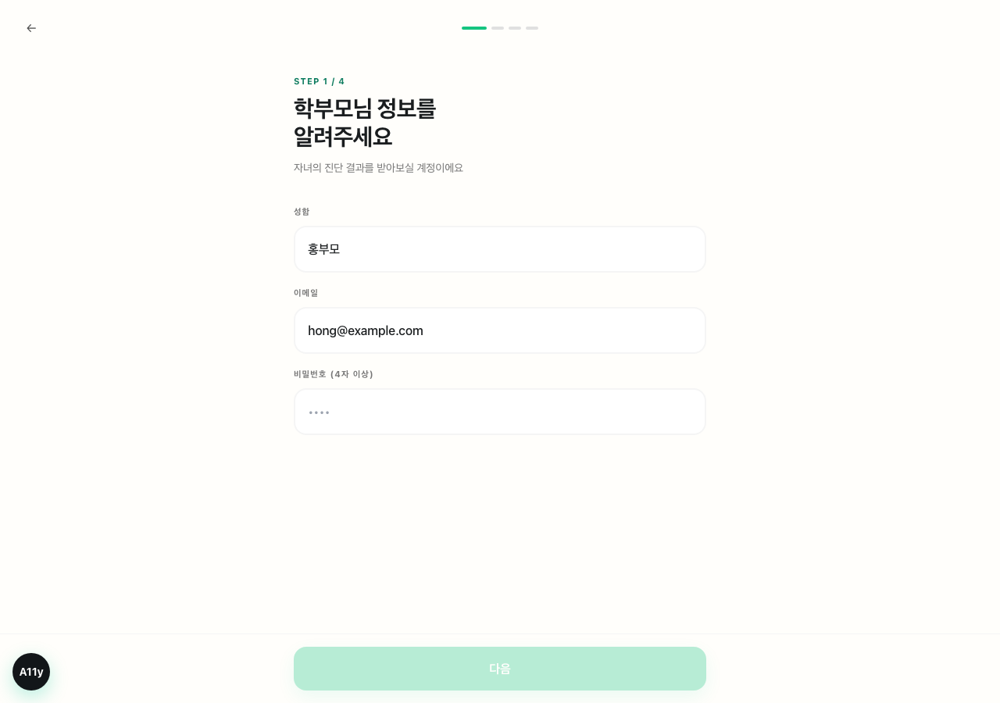 |  |

- **법정대리인 동의 (필수)** — 개인정보보호법 §22조의2
- 학력 진단 데이터 (필수)
- 재능 진단 프리뷰 (필수) — 서울교대 IRB 박민구 교수 책임
- **종단 추적 1년 후 재응시** (선택)
- 마케팅·심화 안내 (선택)
- 데이터 거버넌스 안내 (최소 수집·5년 자동 파기·익명 ID·PIA·재동의)

#### D. 교원 — 담당 학급 알림 발송

- 교원 등록 학생 27명만 조회 가능
- 검사지 생성 + **알림 발송 폼** (대상·채널·제목·본문)

---

## 3.8 FUN-008 · 시스템(홈페이지) 관리 기능

### 핵심 기능 요구사항

메인·서브 페이지의 로고·배너·문구를 관리자가 직접 수정할 수 있어야 하며, 공지사항·Q&A 등 게시판의 등록·수정·삭제 기능과 변경사항 즉시 반영이 요구된다.

### 구현방안

관리자는 별도 개발 요청 없이 직접 홈페이지의 로고·배너·문구를 수정할 수 있으며, 저장 즉시 실제 서비스 화면에 반영된다.

공지사항은 상단 고정·게시 기간 설정 등 세부 옵션과 함께 관리할 수 있다.

Q&A 게시판은 학생·교원·학부모가 질문을 올리면 관리자가 답변을 달 수 있는 구조로 운영되며, 비공개 질문도 지원한다. 이미지는 업로드 시 자동으로 최적화되어 빠르게 로드된다.

### 화면 구현

#### A. 로고·배너·문구 직접 수정 + 즉시 반영

- **학교 이미지 변경**
  - 로고 (PNG/SVG ≤ 1MB) — 현재 미리보기
  - 배너 이미지 (1920×320)
  - 파비콘 (32×32)
- **사이트 문구 6종** 인라인 수정 (사이트 제목 / 메타 설명 / 헤더 슬로건 / 푸터 저작권 / 이메일 / 전화)
- 저장 클릭 → 즉시 라이브 반영

#### B. 공지사항 — 상단 고정·게시 기간·중요 배너·SMS 동시 발송

(같은 페이지 하단 공지사항 옵션 섹션)

- **상단 고정** 토글 (메인 페이지 최상단)
- **게시 기간 설정** (시작일·종료일)
- 중요 공지 배너 노출 옵션
- SMS·이메일 동시 발송 옵션

#### C. Q&A 옵션 — 비공개 질문 + 답변 권한 + 이미지 자동 최적화

(같은 페이지 Q&A 섹션)

- **비공개 옵션 허용** — 학부모↔관리자만 열람 (민감 학습·개인 질문)
- **답변 권한** 선택 (관리자 / 교원 담당 학급 / 학부모 간)
- **이미지 자동 최적화** — WebP 변환 + 크기 조정 (빠른 로드)

#### D. 게시판 (학생·학부모용)

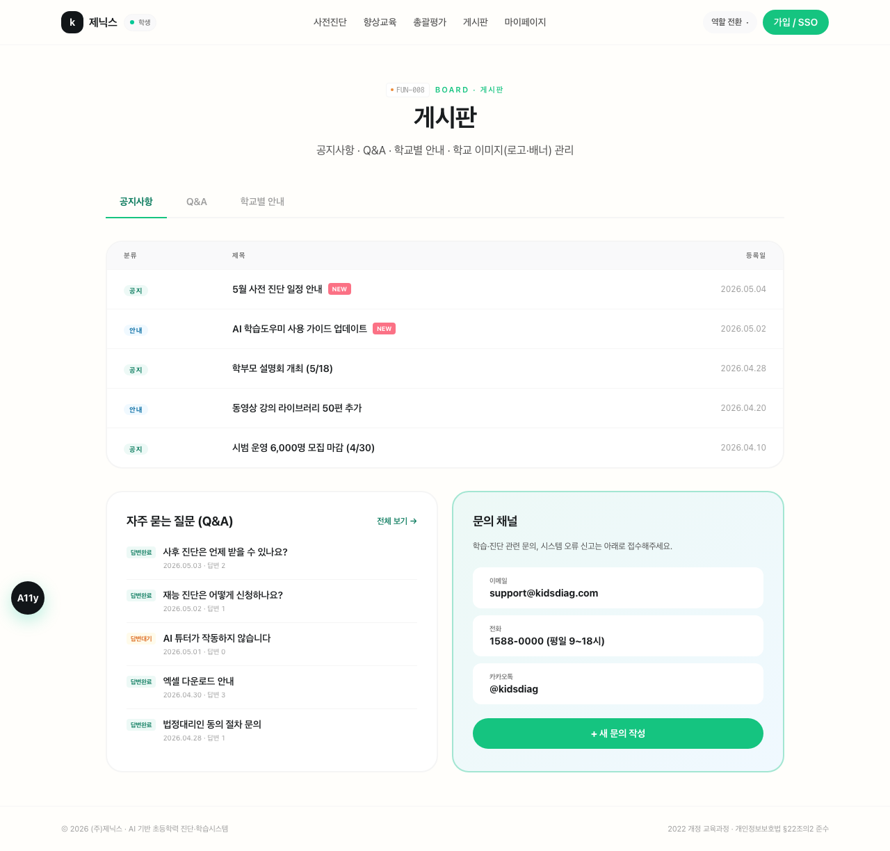

- 공지사항 5건 (NEW 뱃지 자동) + Q&A 5건 (답변완료/대기 뱃지)
- 문의 채널 (이메일 / 전화 / 카카오톡)
- 새 문의 작성 버튼

---

## 📦 산출물 요약

| 항목 | 값 |
|---|---|
| 라우트 | 17개 (정적 export · GitHub Actions 자동 배포) |
| 캡처 | 41+ 풀페이지 PNG (1280×900) |
| 데모 데이터 | 홍길동·홍선생님·홍부모·반친구 5명 일관 |
| 로그인 우회 | 어떤 값으로도 진입 가능 |
| YouTube 연결 | 동영상 8편 클릭 시 EBS·Khan Academy 검색 |
| 반응형 | 모바일/태블릿/PC + 햄버거 메뉴 |
| 접근성 | WCAG 2.1 한국형 토글 (글자 크기·고대비·TTS) |
